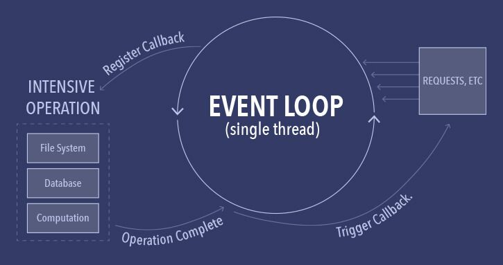
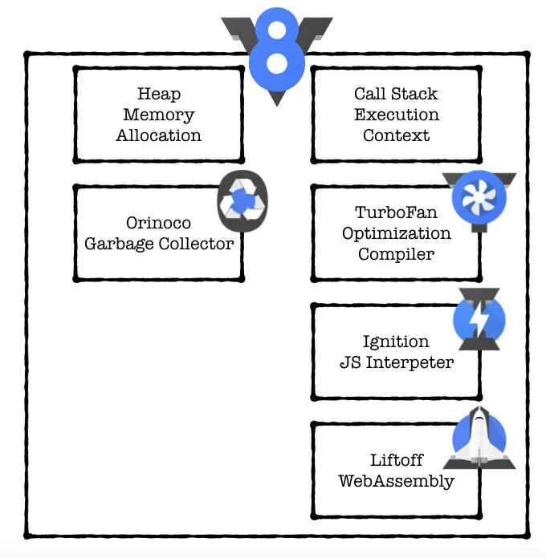
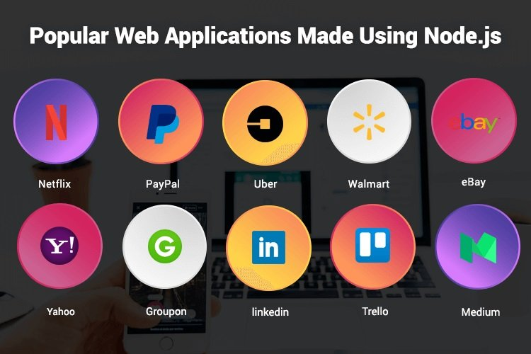

:title: Why Node js 

= Why Node.js ?
Zilogic Systems

== What is Node.js ? 

  * Node.js is an open-source server-side JavaScript runtime environment.
  * Uses V8 Javascript engine.
  * Javascript code runs asynchronously using an event-loop (Non-blocking)
  * API hosting and HTTP request handling.

== Asynchronous Execution

  * JavaScript Code run on a single thread using the Event Loop
  * *High performance.*
  * Don't need to write 'thread-safe' code
  * Less cpu resources used as the program executes primarily on 1 thread.

[%notitle]
=== saososo

== V8 Engine

== Event Loop

image::figures/jloop.png[align="center",alt="event loop",size=contain,canvas]

== libuv Threadpool

  * I/O operations run parallely on separate threads. 
  * Blocking tasks that execute for long time are run on seperate thread.
  * Can scale up easily from default 4 threads up to 1024.

== Node.js clusters

  * Node.js can spawn other Node.js processes that run on different cores of the cpu.
  * Several programs can run parallely on a server cpu to handle requests.
  * Scalable, parallel processing.

[%notitle]
=== noderclust

image::figures/noderclust.png[alt="noderclust",canvas]

== The JavaScript Advantage

  * Backend and Frontend in only one language.
  * Existing frontend developers can learn fullstack within same language
  * Easy frontend backend integration.
  * npm provides thousands of modules for cusomization.

== Express.js vs FastAPI

[%notitle]
=== Express.js

  * JavaScript for backend and frontend.
  * Large amount of community support (2010 release)
  * Lots of customization with npm modules
  * Fast and efficient utilization of cpu

[%notitle]
=== FastAPI

  * Newer framework, smaller community support.
  * Only Backend is python.
  * Less customization.
  * Same speed as Express.js

== Popularity

